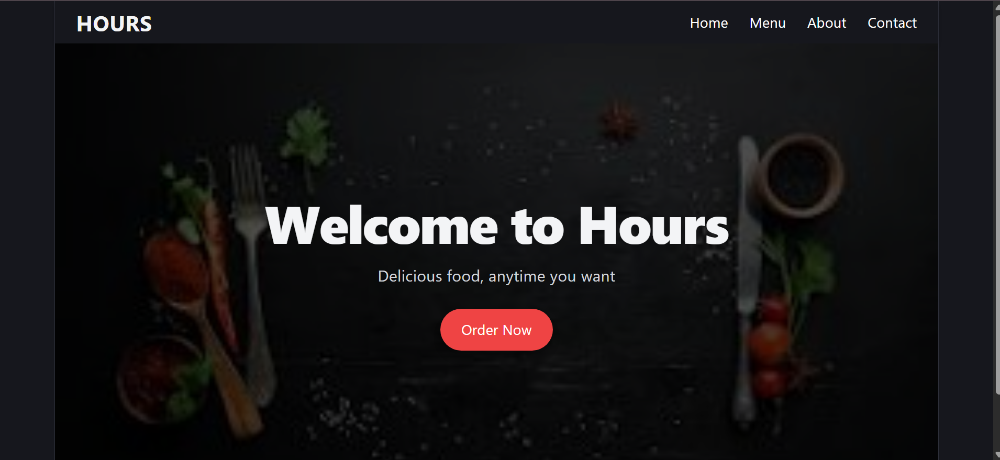

# 🍽️ Hours Restaurant

A modern restaurant website built with React, Vite, and Tailwind CSS.

## 🌐 Live Demo
👉 [hours-restaurant.vercel.app](https://hours-restaurant.vercel.app)

## 📸 Preview



## ✨ Features

- Responsive design (mobile & desktop)
- Multi-page navigation with React Router
- Interactive menu with food items & prices
- Contact page with address & opening hours
- Dark theme UI

## 🛠️ Tech Stack

- **React** — UI library
- **Vite** — Build tool
- **Tailwind CSS** — Styling
- **React Router DOM** — Navigation

## 🚀 Getting Started

```bash
git clone https://github.com/1hafsa/HOURS-RESTAURANT.git
cd HOURS-RESTAURANT
npm install
npm run dev
```

## 📁 Project Structure

```
src/
├── Components/
│   └── Navbar.jsx
├── Pages/
│   ├── Home.jsx
│   ├── Menu.jsx
│   ├── About.jsx
│   └── Contact.jsx
└── App.jsx
```
